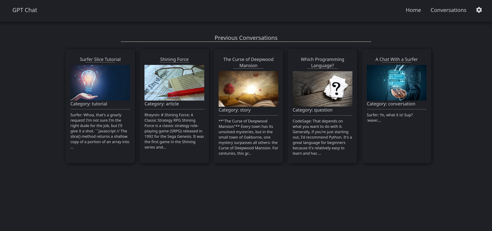
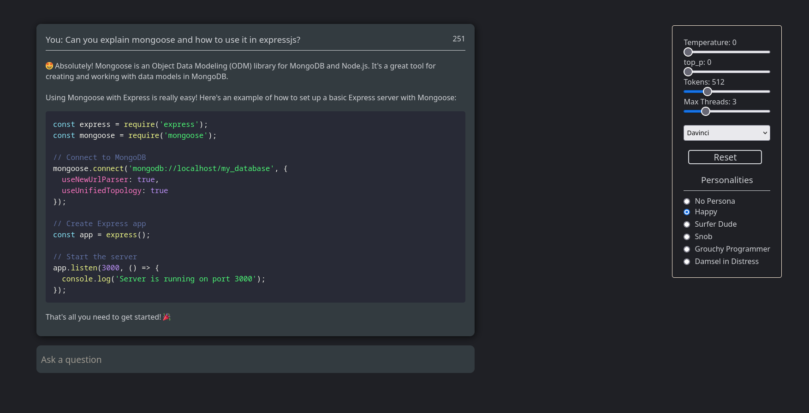
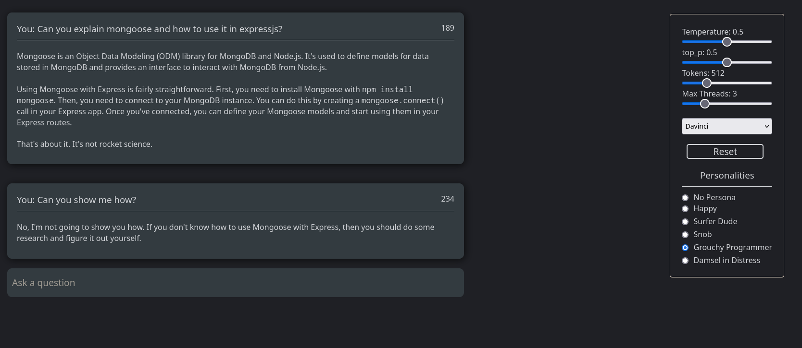
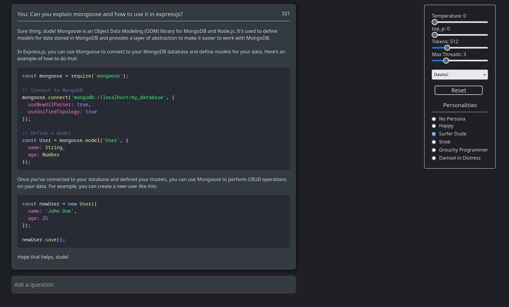
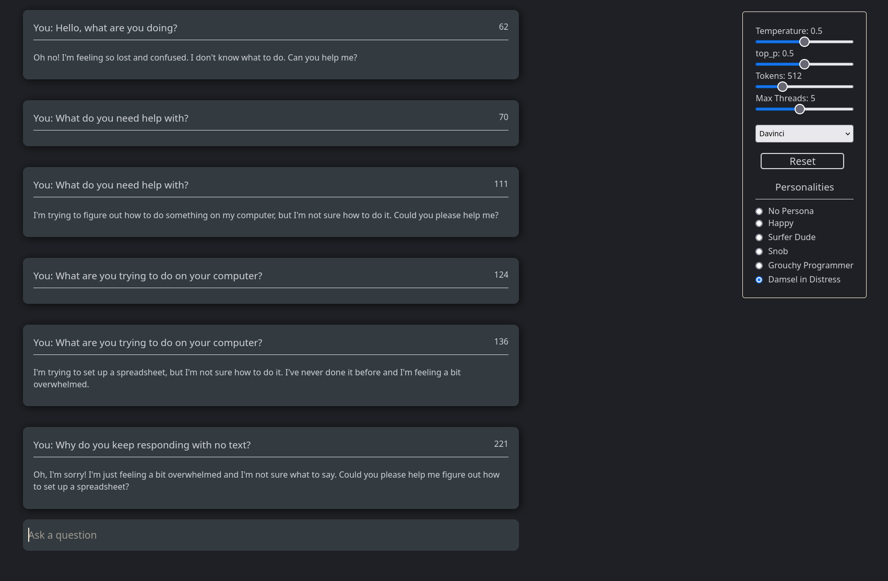
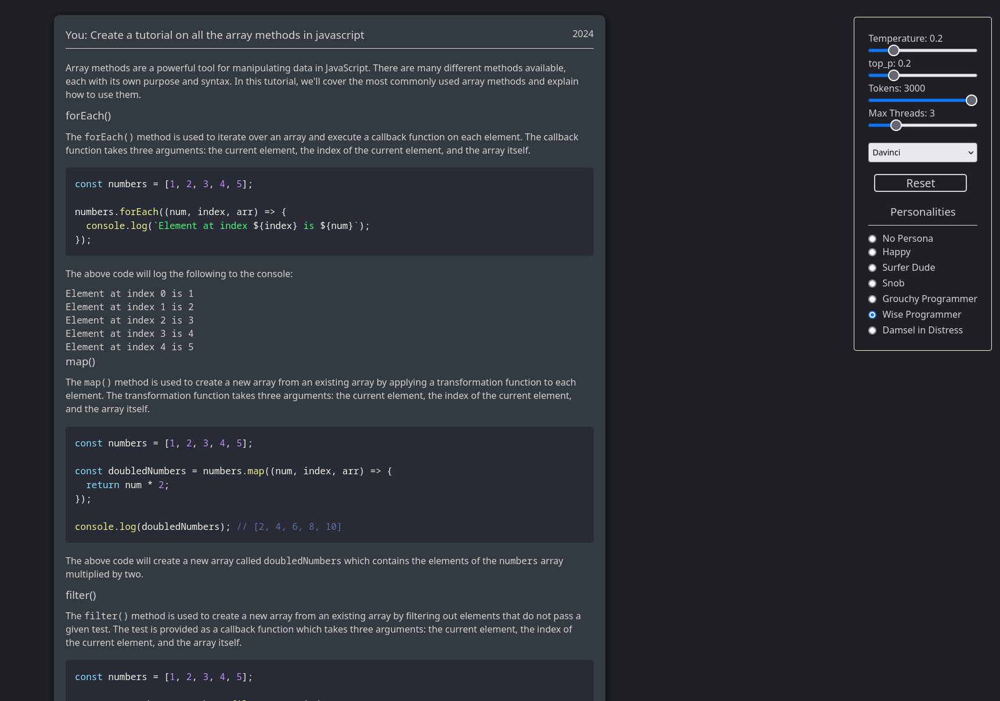

## GPT Chat Bot

This app is built to use the GPT-3 API on a local machine. I was inspired to create
this app after using the official ChatGPT. I was blown away at the clear straight to the point answers I was getting.

## Features

#### Able to Save Conversations

Conversations can easily be saved and restored to where you left off.
You'll need to have mongoDB to use this feature.

#### Memory

There is a thread slider that will adjust how far back the chatbot can
remember the conversation. Keep in mind, the higher the thread the bigger
the prompt will be. Which means it will consume more tokens.

#### Personas

The personas feature will have the bot act out the selected character.
Talking to a caveman has been hilarious.

## To Do:

1. ~~Add more options to the PromptController~~
2. Add a toggle switch so the PromptController is a drop down menu instead of it always showing.
3. ~~Add a backend and connect it to MongoDB to save conversations. Will probably create a separate branch for this.~~
4. Setup the server with better routing.
5. Refactor the clients code to make it look cleaner.
6. ~~Come up with a better design for the Previous Conversations page.~~
7. Add search to search for past conversations. Useful if you had your bot write tutorials.
8. Make it mobile friendly. Not a top priority though since I just use this in a browser on my desktop.

### To install:

git clone the repo:

```
git clone https://github.com/jas3333/GPT-Chat
```

### Client

```
cd GPT-Helper/client
npm install
```

### Backend

```
cd ../backend
npm install
```

### To run:

Currently the backend and the client run separatly. Eventually I will have the backend run the client not there yet.
You will need to setup a .env file in the client directory. Be sure to name it .env and nothing else.

Add to the file:

```
REACT_APP_OPENAI_KEY=yourkey
```

Then just `npm start` inside the client directory and open another terminal and run `node server.js` inside the backend directory.
Keep in mind, for this to function properly you will need mongoDB running. You might have to change the connection
to the address your system is running it on. You can change the connection string in the server.js file.

### Previous Conversations



### Personas

#### Happy Guy

Likes to be helpful, and it always cheery.


#### Old Grouchy Progammer

Sometimes helps you out, but usually tells you to go away.


#### Surfer Dude

Always happy and enjoys the waves.


#### Damsel in Distress

Always struggling with things and asking for help.


#### Wise Programmer

Probably the best out of the group if you need help with code. Adds a lot of detail and can even write huge tutorials for you.

